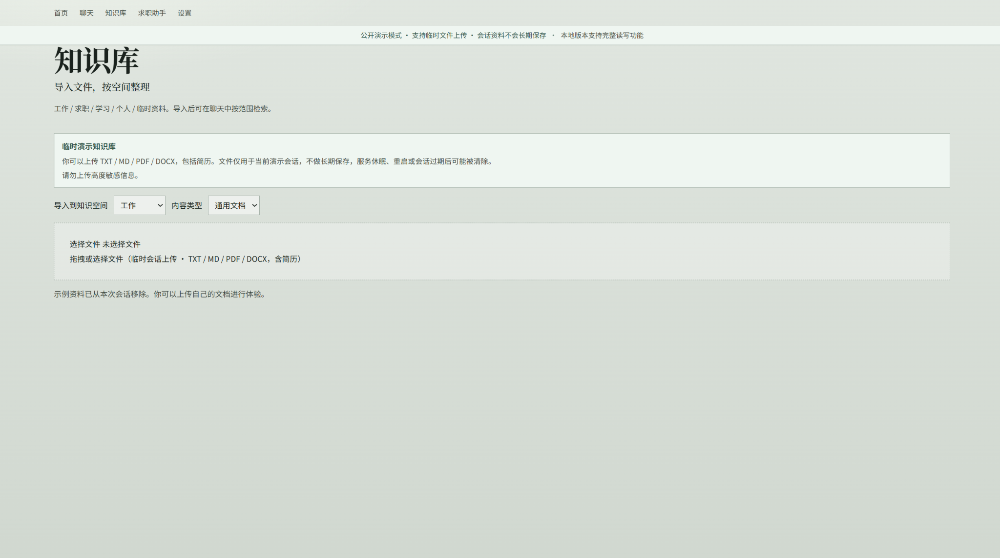
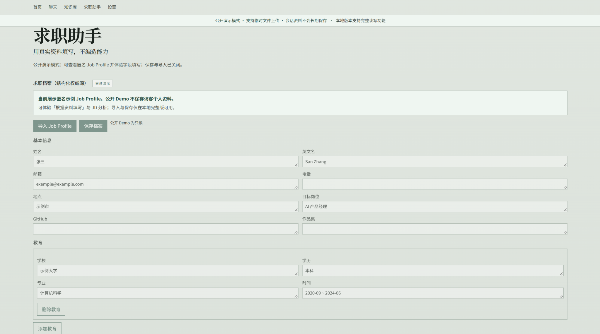
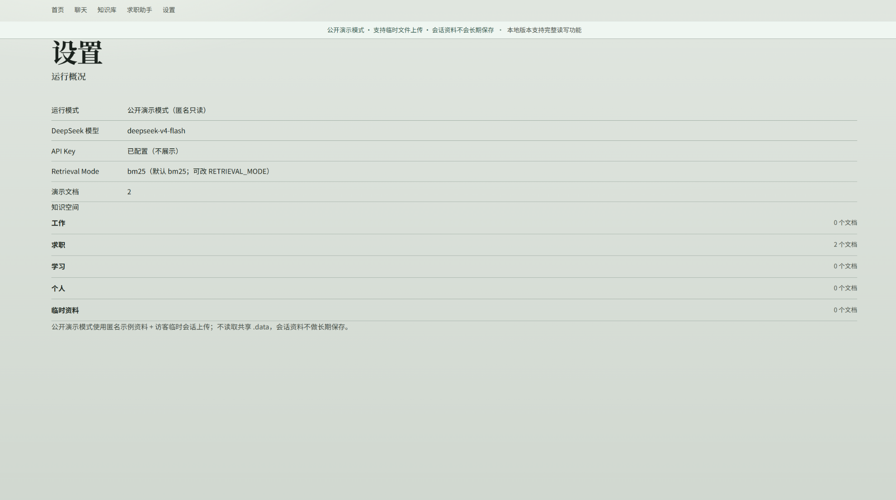

# Cris.Z Agent

一个面向日常、工作、学习与求职场景的个人 AI Agent。

基于 DeepSeek Tool Calling、个人知识库与 Evidence 机制构建，可在通用问答、个人资料事实问答与基于资料生成之间自主切换。

**[🌐 Live Demo](https://cris-z-agent.onrender.com) · [💻 GitHub Repository](https://github.com/CRISZJB/cris-z-agent)**

> Public Demo 支持会话级临时文件上传。上传内容只属于当前演示会话，不做长期保存；示例资料也可以从当前会话中移除，避免干扰自己的测试。

- 导入 TXT / MD / PDF / DOCX（含简历）
- 按知识空间组织资料
- Agent 自主决定是否检索
- 个人事实必须有 Evidence
- 通用问题可以直接回答
- 基于资料可总结、改写和生成
- 回答可展示 Sources
- 求职助手支持结构化 Job Profile、字段填写与 JD 分析

---

## Product Preview

### 1. Home


### 2. Chat


Agent 根据问题类型决定直接回答、检索知识库或读取结构化资料，而不是让每个问题都强制经过 RAG。

### 3. Temporary Knowledge Base



公开 Demo 支持临时上传 TXT / MD / PDF / DOCX（含简历）。访客会话之间相互隔离；示例资料可从当前会话移除，上传资料不会长期保存。

### 4. Job Assistant



公开 Demo 中 Job Profile 使用匿名合成数据并保持只读；本地完整版支持导入、保存与维护结构化求职档案。

### 5. Runtime / Retrieval Settings



默认 Retrieval Mode 为 BM25；Vector / Hybrid 保留为实验能力。

---

## Why I Built It

通用大模型在个人场景里有三个常见问题：

- 不知道我的个人资料
- 容易编造经历
- 很难区分「资料事实」和「模型生成」

因此设计：

**Personal Knowledge + Tool Calling + Evidence + Fact Guard**

目标：让 AI 在真实个人场景里做到——可用、可验证、知道自己的信息边界。

---

## Product Capabilities

| 能力 | 说明 |
|---|---|
| General Knowledge | 普通问题直接回答，不强制 RAG |
| Grounded Fact | 个人事实必须基于 Evidence |
| Grounded Generation | 基于真实资料总结、改写、生成 |
| Knowledge Space | 工作 / 求职 / 学习 / 个人 / 临时资料 |
| File Import | TXT / MD / PDF / DOCX（含简历） |
| Resume-aware Parsing | 简历按经历结构切分；不可靠归属显式标记 |
| Job Assistant | 求职字段填写、JD 分析、Job Profile |
| Sources | 回答显示可验证来源 |
| Hallucination Guard | 防止编造个人经历 |
| Public Demo Isolation | 临时会话上传、TTL 清理、访客隔离 |

---

## Architecture

```text
User
  ↓
Cris.Z Agent
  ↓
DeepSeek Tool Calling
  ├─ Direct Answer
  ├─ search_knowledge
  ├─ read_document
  ├─ list_documents
  └─ structured Job Profile
  ↓
Evidence Validation / Fact Guard
  ↓
Answer + Sources
```

**This is not a fixed RAG pipeline.**

RAG 是 Agent 可以调用的工具，不是每个问题都强制经过 RAG。通用问题可以直接回答；涉及个人资料时，再决定是否检索、读文档、引用 Evidence。

---

## Three Answer Modes

### Grounded Fact

例子：「我的学校是什么？」

规则：必须有 Evidence。没有证据就不能把结论当成个人事实。

### General Knowledge

例子：「什么是 RAG？」

规则：可以直接使用模型通用知识，不强制先检索本地资料。

### Grounded Generation

例子：「根据我的简历写一段自我介绍。」

规则：事实来自资料，表达可以重新组织和生成。

---

## Hallucination Protection

### Case 1：没有证据 ≠ 事实不存在

用户问：「你有没有在 Google 工作过？」

如果知识库没有相关记录，Agent 不直接回答「没有」，而是说明当前资料不足以确认或否认。

**absence of evidence ≠ evidence of absence**。

### Case 2：拒绝顺着错误前提编造

用户问：「介绍一下你负责 TikTok 推荐算法的项目。」

如果资料里没有这段经历，Agent 不应顺着错误前提补故事，而应说明没有证据支持该结论。

---

## Retrieval Experiment

早期做过 BM25 / Vector / Hybrid 对比（N=12）：

| Retrieval | Top1 | Top3 | Top5 |
|---|---:|---:|---:|
| BM25 | 58% | 67% | 83% |
| Vector | 50% | 50% | 58% |
| Hybrid | 50% | 67% | 83% |

结论：BM25 的 Top1 更高；Hybrid 在 Top3 / Top5 与 BM25 持平，没有稳定收益。

因此默认使用：

```text
RETRIEVAL_MODE=bm25
```

Vector / Hybrid 保留为实验能力。检索策略由评测决定，而不是因为某种方案更“AI”就默认启用。

复现：

```bash
npm run eval:retrieval
```

---

## Prompt / Agent Behavior Iteration

Grounded Generation（约 500 字）曾出现：

- 调用约 7 个工具
- 最后一轮 DeepSeek 超时 60s

诊断后发现主要问题是：**冗余工具调用 + 最终生成上下文变大**，而不是 Retrieval 或单个 Tool 本身慢。

改法：约束 Agent 使用 minimum sufficient tools，并压缩工具结果进入最终生成上下文的长度。

优化后本地重复测试：

- 约 150 字生成：约 6–12 秒
- 约 500 字生成：约 11–14 秒
- 重复测试无 timeout

---

## Resume / Job Profile Reliability

PDF 文本抽取后，**公司 → 岗位 → 项目**关系可能被打乱。为避免错误归属，加入：

- resume-aware chunking
- `affiliation_unknown`
- structured Job Profile

Agent 不允许根据文本位置、chunk 顺序或相邻片段，自行猜测项目属于哪家公司。

---

## Job Assistant

`/job-assistant` 支持：

- 结构化 Job Profile
- JSON 导入（本地完整版）
- 公司—岗位—项目绑定
- 求职字段自动填写
- 每字段单独复制
- JD 匹配分析
- 缺失事实显示 `[需要人工补充]`
- 生成字段标记 `AI 生成建议`

不包含浏览器自动填表或自动投递。

---

## Public Demo

在线 Demo：**https://cris-z-agent.onrender.com**

Public Demo 使用匿名 synthetic data + 会话级临时上传：

- 每个浏览器会话使用独立随机 session id
- 支持 TXT / MD / PDF / DOCX（含简历）
- 最多 5 个用户文件 / session
- 单文件最大 3 MB
- 解析文本最大 100,000 chars
- 临时会话 TTL：60 分钟无活动
- 示例资料可从当前会话移除，不影响其他访客
- 不读取共享 `.data`
- Job Profile 保持匿名 synthetic read-only

公开演示不提供长期存储保证，请勿上传高度敏感信息。

---

## Privacy

本地版保存：

- 上传原始文件
- Job Profile
- 文档 metadata
- Retrieval index

会发送给 DeepSeek：

- 当前对话
- 与当前问题相关的检索片段

因此：**不是完全本地推理**。

`DEEPSEEK_API_KEY` 仅在服务端环境变量中使用，不应提交到 Git。

---

## Tech Stack

- Next.js 16
- TypeScript
- DeepSeek Chat Completions / Tool Calling
- Local BM25
- `@huggingface/transformers`（实验 Vector）
- ONNX Runtime
- pdf-parse
- mammoth
- Vitest
- Render（Public Demo）

---

## Evaluation

```bash
npm test
npm run lint
npm run build
```

当前 Release Gate：

- **19 test files / 115 tests passed**
- ESLint passed
- Production build passed

另外保留：

- Retrieval Eval
- Fact Guard / Hallucination regression
- Grounded Generation / Tool limit tests
- Resume affiliation tests
- Public Demo session-isolation tests
- Timeout diagnostics

---

## Local Run

```bash
npm install
```

复制环境变量：

```powershell
Copy-Item .env.example .env.local
```

配置示例：

```text
DEEPSEEK_API_KEY=
DEEPSEEK_MODEL=deepseek-chat
DEEPSEEK_BASE_URL=https://api.deepseek.com
RETRIEVAL_MODE=bm25
PUBLIC_DEMO_MODE=false
```

启动：

```bash
npm run dev
```

访问：

- `/agent` — 聊天
- `/knowledge` — 知识库
- `/job-assistant` — 求职助手
- `/settings` — 设置

---

## Privacy-Safe Repository

以下**不提交** Git：

- `.env.local`
- `.data/`
- 真实上传文件
- 真实 Job Profile
- manual evaluation output

公开仓库只保留代码、匿名 fixture / demo data、文档、测试和评测脚本。

---

## Current Limitations

- PDF 页级定位有限
- Vector / Hybrid 当前没有证明优于 BM25
- Retrieval Eval 样本量仍小（N=12）
- 没有长期记忆
- 没有 MCP
- 没有多模态
- 没有浏览器自动投递
- 依赖 DeepSeek API
- 尚未进行正式用户规模验证
- Render Free 实例冷启动会影响首次访问速度

---

## What I Learned / Product Decisions

1. **RAG 不应该是每个问题的强制路径。** Agent 应能直接回答通用问题。
2. **Evidence 用来约束事实，不应该锁死生成能力。**
3. **没有证据不等于事实不存在。**
4. **Retrieval 技术必须用评测证明价值。**
5. **工具越多不等于答案越可靠。** 冗余调用会拖慢最终生成。
6. **个人 Agent 的知识边界比功能数量更重要。** 知道什么时候不该编，比多一个入口更关键。
7. **公开 Demo 的交互能力与隐私隔离要同时设计。** 临时上传、session isolation、TTL 比“直接开放共享文件系统”更适合公开体验。
